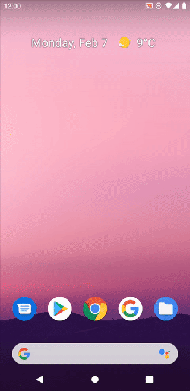

# AndroidAppThemeChange
This is an Android App that change the app theme and save it inside a SharedPreference class. Grab the code and use it for yourself! Visit: https://www.youtube.com/SabithPkcMnr

### Here is the preview of the app.

<h4>Hey, while you're here why don't you think of following me for awesome projects like this, ah? <a href="https://github.com/SabithPkcMnr">Follow Me on my Profile!</a></h4>
